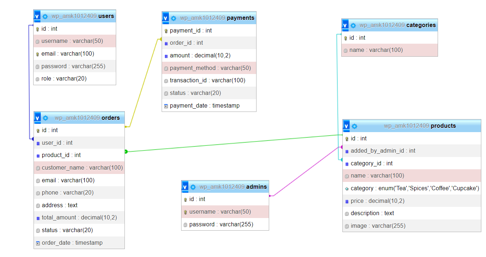

# Project: Serandib Twist (Team No 07)

Serandib Twist is an e-commerce platform specifically built for Sri Lankan spices, tea, coffee, and sweets. Our goal is to create a functional online store with a secure admin area and a dynamic product catalog.

## Table of Contents
* [Features](#features)
* [Database Tables](#database-tables)
* [Created Forms](#created-forms)
* [Created Tables](#created-tables)

## Features
In this section, we track the progress of the core functionalities assigned to team members.

- [x] **Feature 1 (Damith Kodithuwakku):** Admin Security & Portal Management
- [x] **Feature 3 (Imalka Siriwardene):** Product Catalog & Category Filtering
- [x] **Feature 2 (Hasini Manamperi):** Shopping Cart & Order Processing

### Feature 1: Admin Security & Portal
This feature handles backend security, login logic, and admin session management.
* **Code:** [GitHub Link](https://github.com/damithgh/serandib-twist/blob/main/admin.php)
* **Live Link:** [shell.hamk.fi/login.php](https://shell.hamk.fi/~amk1012409/ctwist/admin.php)

### Feature 2: Product Catalog & Dynamic Display
Fetches product data dynamically from the database based on categories like Tea, Spices, and Coffee.
* **Code:** [GitHub Link](https://github.com/your-repo/product_details.php)
* **Live Link:** [shell.hamk.fi/index.php](https://shell.hamk.fi/~user/index.php)

## Database Tables
List of database tables used to store project data.

| Table Name | Created By | Purpose |
| :--- | :--- | :--- |
| `users` | Imalka | Stores customer registration and profile data. |
| `admins` | Hasini | Stores admin credentials for management access. |
| `products` | Damith | Stores item details (name, price, image, description). |
! `payments` ! Hasini ! Stores transaction details (Amount, Payment Method, Date, Transaction ID).!
| `categories` | Imalka | To categorize products (Tea, Spices, Coffee, Sweets). |
| `orders` | Damith | Records customer transaction history and status. |

* **ER Diagram:**  *(Note: Please upload your ER diagram image to the images folder)*

## Created Forms
Forms used for user interaction and data submission.

1. **User/Admin Login Form (Damith):**
   * **Purpose:** To authenticate users and admins.
   * **Validation:** Required fields, session validation, and password verification.
   * **Links:** [Code](https://github.com/your-repo/login.php) | [Live](https://shell.hamk.fi/~user/login.php)

2. **Product Add/Edit Form (Hasini):**
   * **Purpose:** Allows admins to add new items to the store.
   * **Validation:** Numeric check for price, required fields for image and name.
   * **Links:** [Code](https://github.com/your-repo/admin_products.php) | [Live](https://shell.hamk.fi/~user/admin_products.php)

3. **Checkout/Order Form (Imalka):**
   * **Purpose:** Collects shipping details for order placement.
   * **Validation:** Email format validation, required address and phone fields.
   * **Links:** [Code](https://github.com/your-repo/checkout.php) | [Live](https://shell.hamk.fi/~user/checkout.php)

## Created Tables (UI Components)
HTML tables used to display structured data on the website.

1. **Product Inventory Table (Damith):**
   * **Purpose:** Displays all products in the Admin Dashboard.
   * **Links:** [Code](https://github.com/your-repo/admin_products.php) | [Live](https://shell.hamk.fi/~user/admin_products.php)

2. **Shopping Cart Table (Imalka):**
   * **Purpose:** Lists items selected by the customer with quantity and sub-total.
   * **Links:** [Code](https://github.com/your-repo/cart.php) | [Live](https://shell.hamk.fi/~user/cart.php)

3. **Order Summary Table (Hasini):**
   * **Purpose:** Shows final order details before payment confirmation.
   * **Links:** [Code](https://github.com/your-repo/order_summary.php) | [Live](https://shell.hamk.fi/~user/order_summary.php)

## How to Run the Project
1. Import `serandib_twist.sql` into your MySQL database via PHPMyAdmin.
2. Update `db.php` with your database host, username, and password.
3. Access the project via `index.php`.

*Last Modified: February 2026 | Team No 07*

